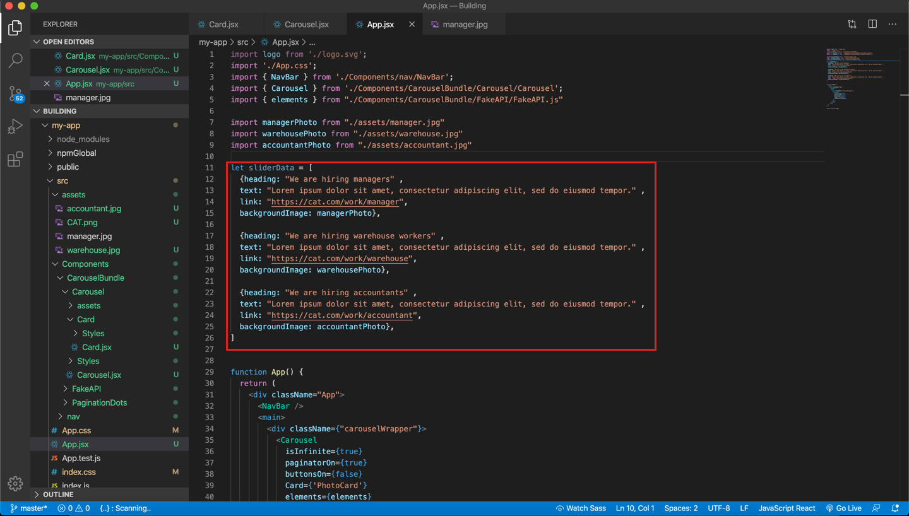

## Customise predefined card component.

Imagine that a large company wants to place a carousel on the homepage, carousel must contain a content which will tell about new vacancies from company. And we can implement it easy and fast with our React Carousel Component.

## To start let’s clone carousel from GitHub repo.
> https://github.com/ArtyomVorontsov/ReactCarousel.git


Great! Now carousel appear within our project folder.


We can enter inside folder ReactCarousel and extract CarouselBundle to our components folder, within CarouselBundle we have all necessary files for our carousel component. The remaining things we can delete because it contains files for carousel sandbox.
Now we can use **<Carousel/>** component.


In our case we insert carousel component directly to the homepage of this site.

## Choosing the Card type and passing additional parameters to attributes.

For our purpose, an average PhotoCard 600px wide is fine, so we will choose it. We pass all the parameters which we need to the attributes and import the test data into the component.


## lets try to run it.


Component work but how we can see we have a large whitespace from above and from below, this is because component by default has a height 100vh, but we can change it in **Carousel.module.scss** by changing in carouselWrapper min-height property:


Or we can use wrapper and limit height like this:


In this case, we will use the wrapper, but changing the height via **Carousel.module.scss** is also a good option. 

Now our component works correctly, but it doesn't show exactly what we need, let's fix it.


## Card customisation.

Our card component currently has default styles and html, but we can change that.

Go to the **Card.jsx** file, find the required Card type and change it, for example like this:


**Important! Change something only inside the wrapper component! Also, you cannot remove the id attribute, it will break the carousel.**

## Now let's create a test data array that will display the card component and pass this array to the carousel.




We pass the array of our data to the elements parameter, but unfortunately nothing will work for now, we need to take a little ride in the carousel ...

And so now we need to connect the data to the map function inside the carousel, go inside the component, find the PhotoCard component and add new attributes there that the Card will accept, you can also remove the picture attribute if you do not use it, but do not delete the key, id and meta attributes.


After all these steps, everything should start working!

## We can start styling the updated PhotoCard.

We go to **Card.module.scss** and look for the photoCard class and inside it we can change almost everything except what is marked in red.


**Important! Do not change photoCardWrapper, userCardWrapper, personalInfoWrapper, fullScreenCardWrapper in this file
this will break the carousel.**

And my photoCard class looks like this:


```
.photoCardWrapper{
    @include flexAlign(column, center, center);
    position: absolute;
    width: 600px;
    height: 400px;
    left: 0;
    transition: left 0.4s ease-in;
}

.photoCard{
    @include flexAlign(column, center, center);
    width: 500px;
    height: 400px;
    box-shadow: -5px 5px 20px rgb(255, 203, 8);
    border-radius: 10px;
    overflow: hidden;
    position: relative;
    background-color: black;
    opacity: 1;

    .textWrapper{
        @include flexAlign(column, start, space-around);
        z-index: 2;
        padding-left: 40px;
    }

    .heading{
        color: white;
       
    }

    .text{
        color: white;
        width: 70%;
    }
    
    .link{
        font-weight: bold;
        text-decoration: none;
        color: white;
        border: solid rgb(255, 203, 8);
        padding: 10px 20px;
    }

    img{
        position: absolute;
        z-index: 1;
        width: 600px;
        opacity: 0.5;
        background: linear-gradient(to left, rgb(0, 0, 0), rgba(0, 0, 0, 0.24));
    }
}

@media (max-width: 375px){
    .photoCard{
        @include flexAlign(column, center, center);
        width: 340px;
        height: 400px;
        box-shadow: -5px 5px 20px  rgb(255, 203, 8);
        border-radius: 10px;

        img{
            user-select: none;
        }
    }
}
```


And the carousel looks like this on desktop:


On mobile:


## Paginator styling.
However, we can also change the colors of the paginator to our corporate color, go to the paginator and then change everything in this way:


Well that's it, we made a custom PhotoCard component and added it to our project.

