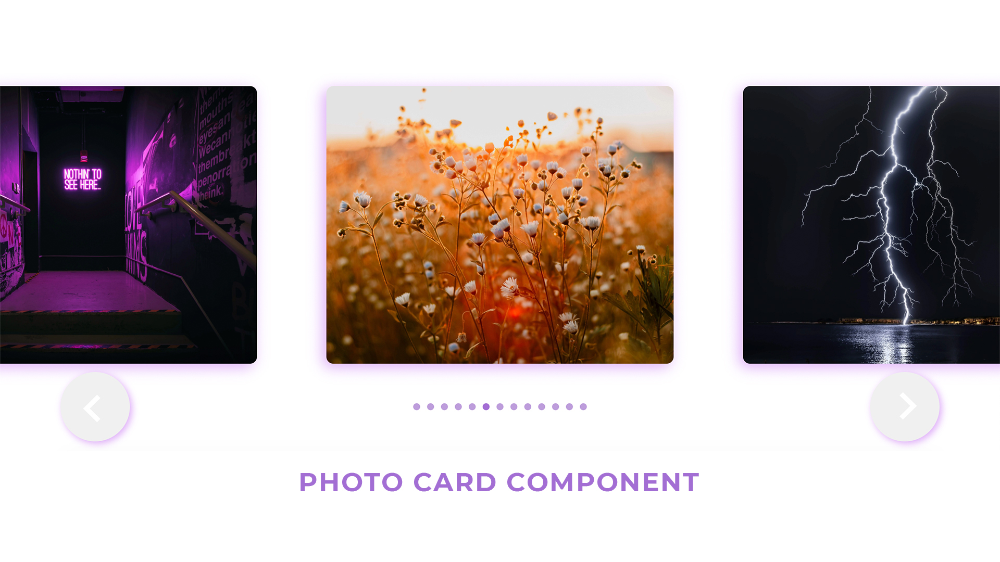
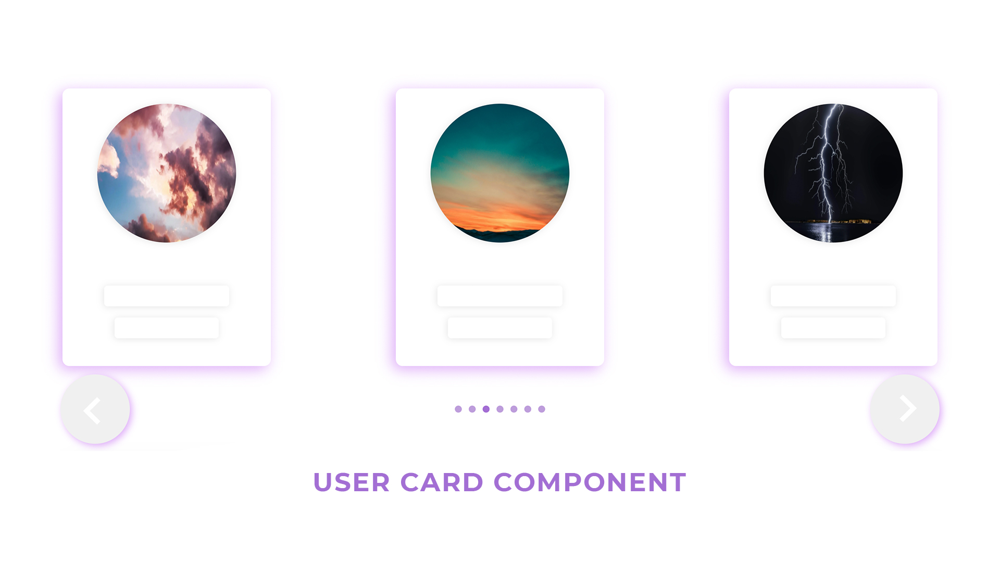
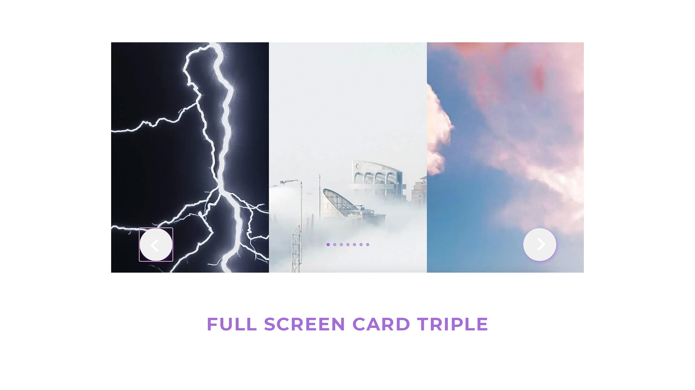

# React Carousel Component


## Description:
This is a  customisable and responsive  component which bring carousel functionality to your react project. 

React Carousel Component SandBox
To try carousel component you need to have installed nodejs and download code from GitHub repo, then open it with IDE and run in terminal command npm install, npm will install all important packages.
To start project on localhost:8080 you need to type npm start in terminal, to build use npm run build

## Usage:
Carousel have a cards which is entity which will be contain your HTML inside, you can create your own card or use predefined types of cards.
Component supports 4 predefined types of cards:

- **PhotoCard - Used for images (Width of card: 600px).**

	
- **UserCard - Used for user information display. (Width of card: 400px).

	
- **FullScreenCard - Card which use full height and width of user browser window (Width of card: window.innerWidth).

	
- **FullScreenCardTriple  - Card which takes 1/3 of user screen, so you can use it for display three cards at the same time.


## Component properties:

- isInfinite={true/false}
	Carousel can be infinite of not.

- paginatorOn={true/false}
You can display or hide paginator.

- buttonsOn={true/false}
You can display or hide carousel buttons.

- Card={"PhotoCard" / “UserCard” / “FullScreenCard” / “FullScreenCardTriple”/ <YourCustomCard/>} 
	You can choose type of card or pass your custom card component.

- elements={ elementsRealPhotos / elements / Your API data }
You can choose API source for carousel, carousel component will map through all API data and render all Cards.

**Properties for custom card component**
- cardWidth={window.innerWidth}
>If you use custom card component you should pass your custom card wrapper width to carousel component.

## Work with predefined components:

All predefined cards support picture attribute, so if you want to use pictures in carousel, just create javascript object something like this: 
	let PhotosAPI = [{ picture: photo1 }, { picture: photo2 }, { picture: photo3 }] 
	
And pass it to carousel like this: 
	<Carousell  Card={“FullScreenCardTitle”} elements={PhotosAPI}  />
Also you can modify card component and add any of HTML content inside.

For this go to:
	./Carousel/Card/Card.jsx
	
Choose component which you wan’t to modify, and modify it:
	//Here will be photo of modified component 
	
If you added new attributes to component, you should go inside Caroulsel.jsx and add your new attributes inside card component which was updated.  
	//Here will be photo of modified component 


## Creating custom card component:
	
You can see references in ./Carousel/Card/Card.jsx
Every card component must have a card wrapper div with id attribute like this:

	export const CustomCardComponent = (props) => {
    	return(
        	<div /* Card wrapper */ id={props.id} >
            	<div /* Card */>
			/* Your HTML content */       
            	</div>
        	</div>
	    )
	}
	
1) Create your component.

2) After your component was created you can pass it to carousel, like this:
```
<Carousell  Card={<YourComponent/>}  />
```
3) Don’t forget add a cardWidth attribute, like here:
```
<Carousell cardWidth={500}  Card={<YourComponent/>}  />
```
>cardWidth attribute should contain your card wrapper width

4) Then you should add data for your card: 
```
<Carousell  Card={<YourComponent/>} elements={YourData}  />
```
Reference for data structure you can find in  ./CarouselBundle/FakeAPI/FakeAPI.js
	
5) Next step will be connect your data for component with component itself. You should go inside carousel component and add to Card your props, after that your carousel should work correctly.


## Prohibitions and recommendations:

- Don’t use FullScreenCardTriple with isInfinite={false} only with isInfinite={true}.
- Use images which is compressed with squoosh.app or tinypng.com recommended images extensions is jpg or webp.


